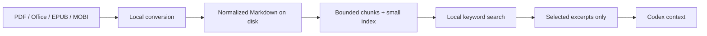

# Codex Document Prep

[](https://github.com/wbjm1225-jpg/codex-document-prep/actions/workflows/test.yml)
[](https://github.com/wbjm1225-jpg/codex-document-prep/releases/latest)
[](LICENSE)
[](https://www.python.org/)

> **Stop feeding entire documents to Codex. Prepare locally, search first, and read only the relevant chunks.**

面向 Codex 的本地文档预处理技能：把 PDF、Word、Excel、PowerPoint、EPUB、MOBI 等资料转换、清理、切块并建立轻量索引，让 Codex **先搜索、后读取、只取相关片段**。

Codex Document Prep is a local-first, retrieval-bounded Agent Skill. It keeps converted documents on disk, returns compact search results, and applies hard limits when selected chunks are read into context.

## Why it is different

- **Search before reading** — build a small index and retrieve only matching chunks.
- **Local-first** — no document upload, external API, LLM OCR, or package installation by default.
- **Bounded context** — preparation prints only compact statistics; search and reading have explicit limits.
- **Multi-format** — use one workflow for books, Office files, PDFs, HTML, Markdown, CSV, and folders.
- **Zero-dependency baseline** — parse DOCX, XLSX, PPTX, EPUB, HTML, Markdown, text, CSV, TSV, JSON, and XML with Python's standard library.
- **Progressive enhancement** — automatically route to MarkItDown, Pandoc, Poppler, or Calibre when they are already available.
- **Originals stay untouched** — write only to the selected output directory.

> Converting a file to Markdown alone does not guarantee lower usage. The reduction comes from bounded retrieval: Codex avoids loading the normalized full text unless the task genuinely requires it.

## Quick start

### Install in Codex

```text
$skill-installer https://github.com/wbjm1225-jpg/codex-document-prep/tree/main/skills/codex-document-prep
```

### Install with the Agent Skills CLI

```bash
npx skills add wbjm1225-jpg/codex-document-prep \
  --skill codex-document-prep \
  --agent codex \
  --global
```

Restart Codex if the skill does not appear immediately.

### Ask Codex

```text
$codex-document-prep Prepare /path/to/books in /path/to/prepared,
then retrieve only passages about discounted cash flow. Do not read full documents.
```

中文示例：

```text
$codex-document-prep 把 /path/to/books 预处理到 /path/to/prepared，
然后只检索“现金流折现”的相关章节，禁止读取全文。
```

## Why it can reduce context

| Workflow | What normally enters model context |
|---|---|
| Read the original directly | Potentially the full extracted document |
| Convert to Markdown only | Potentially the full converted Markdown |
| Codex Document Prep | Small index → bounded search hits → selected chunks only |

The actual reduction depends on document size, query specificity, selected chunk count, and whether the task requires complete coverage. It should be measured as **source-material context reduction**, not treated as a guaranteed reduction in total Codex credits or billing.

## How it works



## Format support

| Format | No extra dependency | Optional enhancement |
|---|---:|---|
| DOCX | ✅ | MarkItDown / Pandoc |
| XLSX | ✅ | MarkItDown / Pandoc |
| PPTX | ✅ | MarkItDown / Pandoc |
| EPUB | ✅ | MarkItDown / Pandoc |
| HTML, Markdown, TXT, CSV, TSV, JSON, XML | ✅ | — |
| Text-based PDF | — | MarkItDown or `pdftotext` |
| Scanned PDF | — | Local Docling / Marker OCR with explicit approval |
| MOBI, AZW3 | — | Calibre `ebook-convert` |
| DOC, XLS, RTF | — | MarkItDown / Pandoc, format-dependent |

DRM-protected books are outside the project scope. The project does not bypass DRM.

## Use the scripts directly

```bash
python3 skills/codex-document-prep/scripts/check_dependencies.py

python3 skills/codex-document-prep/scripts/prepare_documents.py \
  /path/to/books \
  --output-dir /path/to/prepared

python3 skills/codex-document-prep/scripts/search_chunks.py \
  /path/to/prepared \
  "cash flow discount rate" \
  --top 5

python3 skills/codex-document-prep/scripts/read_chunks.py \
  /path/to/prepared \
  documents/example/chunks/0001.md \
  --max-chars 6000
```

Prepared output:

```text
prepared/
├── index.md          # Small catalog; inspect this first
├── manifest.json     # Converters, chunk paths, warnings, and errors
└── documents/
    └── <document-id>/
        ├── source.md # Normalized full text; do not read by default
        └── chunks/
            ├── 0001.md
            └── ...
```

## Best use cases and limits

Best for large files, multiple books, repeated questions, cross-document search, and analysis limited to particular chapters, worksheets, or topics.

It helps less when a task requires reading every page, visually reviewing the original layout, or reproducing complex formatting exactly. Full-coverage tasks may save little context and add a small indexing overhead.

## Privacy and security

The skill does not install packages, download OCR models, call external APIs, or enable LLM-assisted OCR without explicit approval. Converted files remain in the output directory selected by the user. See [SECURITY.md](SECURITY.md) for responsible disclosure and document-safety guidance.

## Development

```bash
python3 -m py_compile skills/codex-document-prep/scripts/*.py
python3 tests/test_smoke.py
```

Contributions are welcome, especially for format compatibility, chunking strategies, Chinese retrieval, and local OCR routing. Read [CONTRIBUTING.md](CONTRIBUTING.md), open an [issue](https://github.com/wbjm1225-jpg/codex-document-prep/issues), or start a [discussion](https://github.com/wbjm1225-jpg/codex-document-prep/discussions).

## License

[MIT](LICENSE)
