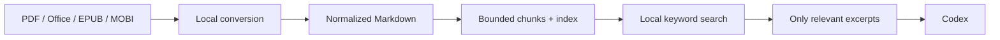

# Codex Document Prep

[](https://github.com/wbjm1225-jpg/codex-document-prep/actions/workflows/test.yml)
[](LICENSE)
[](https://www.python.org/)

**Local-first document preprocessing for token-efficient Codex workflows.**

把 PDF、Word、Excel、PowerPoint、EPUB、MOBI 等资料在本地转换、清理、切块和索引，让 Codex **先搜索、后读取、只取相关片段**，避免把整本书或整份报表塞进上下文。

> 这不是“把文件换成 Markdown 就自动省额度”。真正的优势来自：转换不回显全文、索引很小、检索结果有上限、只读取命中的块。

## 为什么使用它

- **节省上下文**：针对性查询中，源材料输入量通常可减少 90% 以上；实际额度节省取决于模型、任务和读取范围，不作固定比例承诺。
- **本地优先**：默认不调用 API、不启用 LLM OCR、不上传文档。
- **受控输出**：转换阶段只返回路径和统计信息，绝不把全文打印进工具结果。
- **按需读取**：默认约 5,000 字符切块；搜索和读取都有硬上限。
- **多格式统一处理**：一本书、一个 Office 文件或整个资料目录使用同一套工作流。
- **零依赖基础解析**：DOCX、XLSX、PPTX、EPUB、HTML、Markdown、TXT、CSV、TSV、JSON、XML 可仅用 Python 标准库处理。
- **渐进增强**：检测到 MarkItDown、Pandoc、Poppler 或 Calibre 时自动使用更合适的本地转换器。
- **保护原件**：只写入指定输出目录，不修改源文件。

## 工作方式



## 格式支持

| 格式 | 无额外依赖 | 可选增强 |
|---|---:|---|
| DOCX | ✅ | MarkItDown / Pandoc |
| XLSX | ✅ | MarkItDown / Pandoc |
| PPTX | ✅ | MarkItDown / Pandoc |
| EPUB | ✅ | MarkItDown / Pandoc |
| HTML、Markdown、TXT、CSV、TSV、JSON、XML | ✅ | — |
| PDF（文本型） | — | MarkItDown 或 `pdftotext` |
| PDF（扫描型） | — | 本地 Docling / Marker OCR，需用户明确安装 |
| MOBI、AZW3 | — | Calibre `ebook-convert` |
| DOC、XLS、RTF | — | MarkItDown / Pandoc，取决于格式 |

DRM 保护的电子书不在支持范围内，本项目不会绕过 DRM。

## 安装

在 Codex 中使用技能安装器：

```text
$skill-installer https://github.com/wbjm1225-jpg/codex-document-prep/tree/main/codex-document-prep
```

也可以克隆仓库，把 [`codex-document-prep`](codex-document-prep/) 目录链接或复制到个人技能目录。Codex 没有立即显示新技能时，重启一次应用。

## 使用

自然语言调用：

```text
$codex-document-prep 把 /path/to/books 预处理到 /path/to/prepared，
然后只检索“现金流折现”的相关章节，禁止读取全文。
```

脚本也可以独立使用：

```bash
python3 codex-document-prep/scripts/check_dependencies.py

python3 codex-document-prep/scripts/prepare_documents.py \
  /path/to/books \
  --output-dir /path/to/prepared

python3 codex-document-prep/scripts/search_chunks.py \
  /path/to/prepared \
  "现金流 折现率" \
  --top 5

python3 codex-document-prep/scripts/read_chunks.py \
  /path/to/prepared \
  documents/example/chunks/0001.md \
  --max-chars 6000
```

准备后的目录：

```text
prepared/
├── index.md          # 小型目录，先读这个
├── manifest.json     # 转换器、块路径、警告和错误
└── documents/
    └── <document-id>/
        ├── source.md # 规范化全文；不要默认整份读取
        └── chunks/
            ├── 0001.md
            └── ...
```

## 适用场景与边界

最适合：大文件、多本书、跨资料库检索、反复查询、只分析部分章节或工作表。

帮助较小：必须通读全文的整本总结、视觉版式审查、需要百分百还原复杂排版的小文件。针对性检索可能显著降低源材料上下文；全文任务则可能几乎不节省，甚至因为索引步骤略有额外开销。

## Privacy and design principles

Codex Document Prep is local-first and retrieval-bounded. It does not install packages, download OCR models, call an external API, or enable LLM-assisted OCR without explicit approval. Conversion output is written to disk, while terminal output stays compact.

The project favors predictable context control over visual fidelity. It is designed for analysis and retrieval, not document editing or archival conversion.

## 开发与测试

```bash
python3 -m py_compile codex-document-prep/scripts/*.py
python3 tests/test_smoke.py
```

欢迎提交 Issue 和 Pull Request，尤其是格式兼容、切块策略、中文检索和本地 OCR 路由方面的改进。

## License

[MIT](LICENSE)
